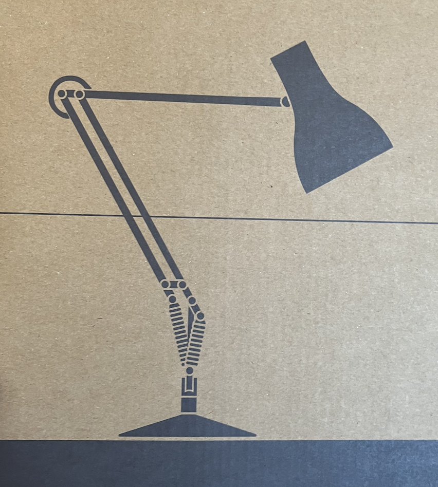
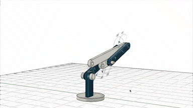

# Lifter 

## Inspired by a Lamp 
Its got its kinematics completely "borrowed" from a lamp (weird right?)
{ align=left }

{ align=left }{ width="800" }

Here's how it looks in motion (demo model)

## Download the Latest CAD
(Pulled right from our team files, may be experimental)
<iframe src="https://icloud11636.autodesk360.com/shares/public/SH35dfcQT936092f0e433ce4fa157145dd8c?mode=embed" width="640" height="480" allowfullscreen="true" webkitallowfullscreen="true" mozallowfullscreen="true"  frameborder="0"></iframe>

## Project Goals
- [ ] Lightest arm possible for extension distance (Unknown)
- [x] High stiffness 
- [x] Limited “linear motion” components
- [x] Low cost 
- [x] Easily sourced / made parts (as little CNC as possible).
- [x] High extension to weight ratio.
- [x] Easily serviced
- [x] Easily replaced
- [x] Modular
- [x] Easy to modify
- [x] Limited expensive COTS parts
- [x] Use off the shelf raw materials

## Implemented Features
- Bushings!
    - Bushings offer a cheap alternative to bearings we can make ourselves by 3d printing Nylon. These should be good for the low speed / high load application we are using them for (sub 1 rpm)
- 19mm Square Aluminum Extrusion (16gauge)
    - This stuff is really good, requires no CNC machining for our use, can be easily fabricated by hand into the shapes we need. Its also super light: each link of the arm is less than 150g! 
- Low motor placement
    - By using this unique lever setup, our arm can be much more rigid than a standard two link arm, and it places the motors low, keeping our COM close to the base of the robot. This aids balance when moving at speed with full extension. 
- High Extension (and easily folded into 18" cube)
    - Our two motor + 1 servo setup lets us fold the arm back into the empty space above the chassis during the start of the game. We can then extend it forward, and upward to reach for elements. 

