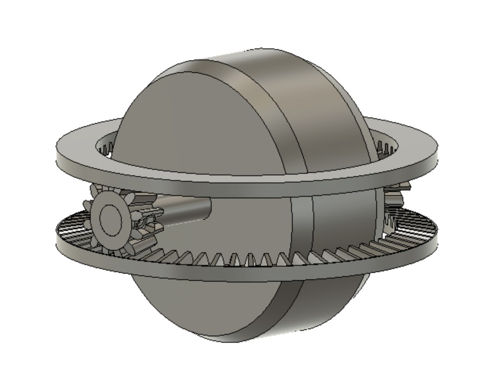
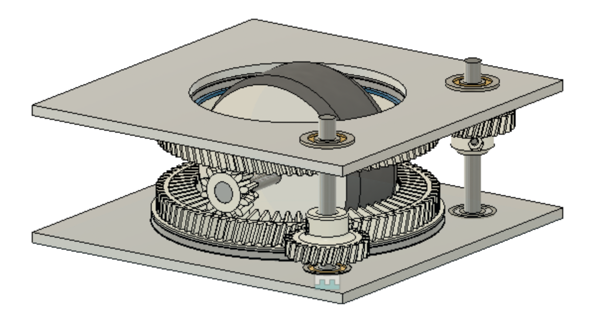

<link rel="preconnect" href="https://rsms.me/">
<link rel="stylesheet" href="https://rsms.me/inter/inter.css">

# MiniSwerve
{ align=left }

## Our Drivetrain: What is swerve?

Generally any Swerve system refers to a 360° wheel steering. Our flavor of swerve is often called "differential swerve" refering to how the motors work together to orient, and drive the wheel. We'll update our sister site for software with more info on how we control this. 

## Big Picture: Swerve Robot

To create a comeptitive drive train, we put two identical Miniswerve 'pods' next to each other. Why only 2? Each of our swerve pods require two full size motors, and a classic mecanum drivetrain is 4 motors. Miniswerve is designed to be a cost comparable replacement for Mecanum, so not taking any more motors than absolutely neccesary is important: it lowers cost, complexity, and makes replacement of existing mecanum systems more accessible. 

But if Miniswerve is a Mecanum replacement, why bother with something new?
Miniswerve should be better than a comparable mecanum drivetrain in a few ways: 

- [x] More Traction 
- [x] Equal top speed & torque in all directions
- [x] Absolute control over wheel position
- [x] Higher Agility

## Drawbacks

Unfortunately there are some downsides, and we aren't here to hide them. So far we've struggled with: 

- [ ] Ground Clearance
- [ ] Maintenance
- [ ] Ease of assembly
- [ ] Ease of manufacturing

Hopefully as a team we iterate we can eliminate or mitigate these issues, and perhaps teams that choose to develop evolutions of MiniSwerve will come up with unique ways to tackle these drawbacks too!

## From Concept to Robot

Miniswerve is our teams biggest accomplishment so far, even though its not finished. 
We've built two pods, gone through 3 hardware iterations, and began to tackle the enormous task of programming swerve. 

<figure markdown>
  { width="300" }{ align=center }
  <figcaption>April 13, 2022: Initial concept of gears, and choosing underlying ratios, much of this geometry is preserved in the final drawings. Also includes a 90mm mockup wheel. </figcaption>
</figure>

<figure markdown>
  { width="300" }{ align=center }
  <figcaption>April 15, 2022: Initial concept of mounting plates, first introduction of drive shafts and gears. This is where Miniswerve started to take form. On the same day, the definining difference for MiniSwerve was introduced: Thrust bearings. We'll have a whole section on this soon. </figcaption>
</figure>

## Today

MiniSwerve got its start early, and its taken a while to bring it to this point. We have real prototypes that move(although no fully functional code base as of yet). It's been an awesome journey, and one we are definitly continueing. Let us know if you interested in our progress, have questions, or have feedback on our design. 

Reach out to Hardware lead Grady Conwell at gconwell@lacanadaengineeringclub.org 

{ align=left }
Machining prototypes of the Swerve system. 

## Download the latest CAD
This is pulled right from Fusion, so it may be experimental or untested. But it should be the latest. Find releases of just the "swerve module" in its repo, here: https://github.com/TheDragonlizard/MiniSwerve  

<iframe src="https://icloud11636.autodesk360.com/shares/public/SH35dfcQT936092f0e43955c17b2f02d9e36?mode=embed" width="800" height="600" allowfullscreen="true" webkitallowfullscreen="true" mozallowfullscreen="true"  frameborder="0"></iframe>

