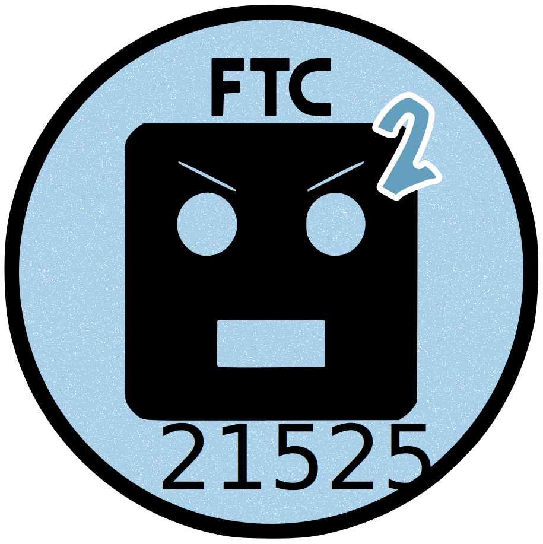

<link rel="preconnect" href="https://rsms.me/">
<link rel="stylesheet" href="https://rsms.me/inter/inter.css">

# About Us

<figure markdown>
  { width="400" }
  <figcaption>Team 21525</figcaption>
</figure>

## Code coming soon! 
We'll be featuring docs on our src code as well. Stay tuned.  

## Team 21525 Quick Facts
* Formed in 2022, first season 2022-23
    * Members of this years team previously competed as team 5921.
* Currently consists of 11 members 
* Fully student Designed and Built 
* Fully Open Source :material-open-source-initiative:
    * We publish our source and document our progress as it happens so that we can best serve as a resource to newer teams. 
* Pushing the limits of FTC
    * We purposefully challenge ourselves to try stuff that may seem a bit out there in order to best push the FTC community forward. 
    * We try to incorporate innovative solutions in a accesible way, in a manner that lowers technical and financial the barrier of entry for performance hardware and software.
* Always available to help
    * We'll answer any of your questions about our CAD, Code, or documentation to the best of our abilities. Feel free to shoot us a message. 

## Attributions
* We use Inter, an awesome open source font by Rasmus Andersson. Check it out here: https://rsms.me/inter/
* Our CAD contains downloaded reference geometry from REV, GOBIlDA, AndyMark & Misumi. 